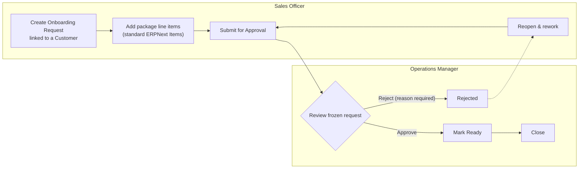
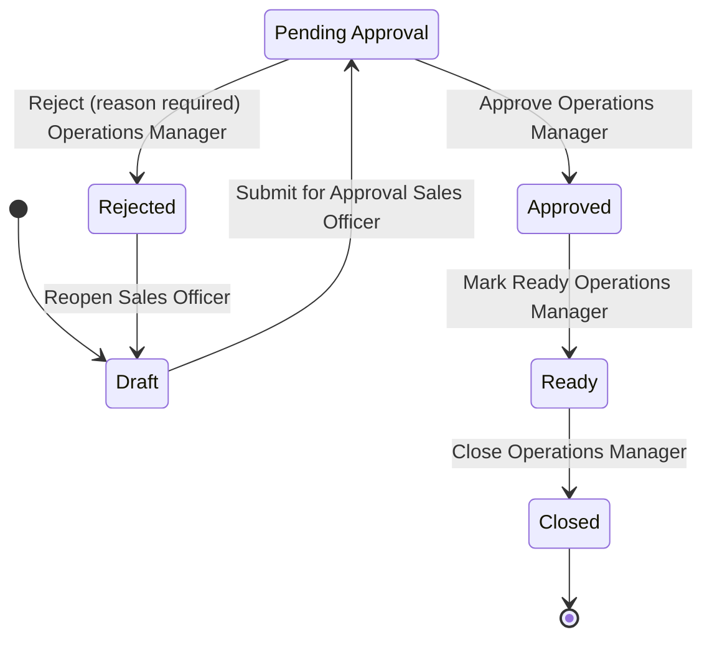

# ERPNext Onboarding

A custom Frappe app implementing a client-onboarding approval workflow on top of
ERPNext from CRM handover to "ready for storage agreement" with server-side
enforcement of every business rule, real role-based permissions, separation of
duties, an append-only audit trail, an operational report, and a secured REST API.

Built for the CryoCord ERPNext / Frappe Systems Developer technical exercise.
Frappe/ERPNext **version-15**.

---

## Contents

1. [What this app does](#what-this-app-does)
2. [Setup](#setup)
3. [Demo walkthrough](#demo-walkthrough)
4. [Data model](#data-model)
5. [State machine](#state-machine)
6. [Server-side guards](#server-side-guards)
7. [Design rationale the six questions](#design-rationale--the-six-questions)
8. [Role & permission matrix](#role--permission-matrix)
9. [Audit trail: guarantees and limits](#audit-trail-guarantees-and-limits)
10. [Report](#report)
11. [REST API](#rest-api)
12. [Upgrade safety](#upgrade-safety)
13. [Production-readiness note](#production-readiness-note)
14. [Assumptions](#assumptions)
15. [What I verified](#what-i-verified)
16. [What I would do with more time](#what-i-would-do-with-more-time)

---

## What this app does

CryoCord's sales and operations teams manage client onboarding by email: a sales
officer asks an operations manager to review storage packages, pricing, and
discounts; the decisions and their reasons live in scattered threads.

This app moves that lifecycle into ERPNext:



Every transition is recorded in an append-only audit log: who, when,
from-state, to-state, action, and reason.

---

## Setup

### Installing the app (reviewer path)

On any Frappe v15 bench with ERPNext installed:

```bash
cd $BENCH
bench get-app https://github.com/salcad/erpnext_onboarding
bench --site <site> install-app erpnext_onboarding
bench --site <site> migrate
```

Notes:

- `hooks.py` declares `required_apps = ["erpnext"]` installation onto a site
  without ERPNext fails fast instead of half-installing.
- The install/migrate syncs everything: three DocTypes, two Roles, the Workflow
  (6 states, 6 transitions), and the script report. No manual UI setup steps.
- The site should have completed the ERPNext setup wizard (the app links to
  Customer and Item, whose default masters the wizard creates).

### Dev environment used for this submission (optional detail)

Developed on a containerized bench (official `frappe/bench` image with
`mariadb:10.11` and `redis:6.2`), Frappe 15.113.4 / ERPNext 15.115.0,
Python 3.12. Nothing in the app depends on Docker; it installs on any
standard bench.

---

## Demo walkthrough

```bash
# 1. create two demo users (or use existing ones) and assign roles:
#    - a Sales Officer        (creates and submits requests)
#    - an Operations Manager  (approves / rejects / readies / closes)

# 2. as Sales Officer, in the Desk UI:
#    Onboarding Request → New
#    pick a Customer, add line items (Item / qty / rate / discount %)
#    → totals are computed server-side, read-only
#    → Actions → Submit for Approval

# 3. as Operations Manager:
#    open the request (content is now frozen)
#    → either Actions → Approve
#    → or type a Decision Reason, then Actions → Reject

# 4. inspect the trail:
#    Onboarding Audit Log list, filtered by the request
#    (every transition: actor, timestamp, from/to, action, reason)

# 5. reports: Pending Approvals by Age

# 6. API:
curl -H "Authorization: token <api_key>:<api_secret>" \
  "https://<site>/api/method/erpnext_onboarding.api.get_request_status?name=ONB-2026-00001"
```

Try to cheat that's the point of the design:

- approve a request you created (even with the Operations Manager role) → 403
- `PUT /api/resource/Onboarding Request/<name>` with `workflow_state: "Approved"`
  as a Sales Officer → blocked in Python, not just hidden in the UI
- edit a line item while Pending → blocked (content freeze)
- edit or delete an Onboarding Audit Log row even as Administrator → blocked

---

## Data model

Three custom DocTypes; everything else is reused from ERPNext.

### Onboarding Request (parent)

| Design element | Choice | Why |
| --- | --- | --- |
| Naming | `format:ONB-{YYYY}-{#####}` → `ONB-2026-00042` | Sortable, year-scoped, human-quotable in emails and calls |
| `customer` | **Link → Customer, required** | The one non-negotiable link: reuse the standard client master |
| `lead`, `opportunity` | Link, optional | Record CRM origin without forcing CRM usage |
| `requested_by` | Link → User, read-only | Stamped from the session in `before_insert`; provenance never comes from user input |
| `workflow_state` | Select, read-only, 6 options | Single source of lifecycle truth; written only by the workflow/guard machinery |
| `items` | Table → Onboarding Request Item | The child table (see below) |
| `total_amount`, `discount_amount`, `final_amount` | Currency, read-only | Computed in `validate()` on every save client-sent values are always overwritten |
| `approved_by`, `decided_on` | read-only, no-copy | Stamped server-side at decision time |
| `decision_reason` | Small Text, **permlevel 1** | Only Operations Manager can write it (field-level permission, enforced server-side) |
| Not submittable | no `docstatus` | Deliberate see rationale Q1/Q2 discussion below |

**Why not submittable?** Frappe's submit/cancel/amend cycle creates amended
duplicates (`-1`, `-2` …). An amended copy would orphan the audit trail of the
original the history would describe a document that is no longer the live one.
The lifecycle here is fully expressed by `workflow_state` plus Python
immutability guards, which keeps one continuous record with one continuous
history.

### Onboarding Request Item (child table)

| Field | Type | Notes |
| --- | --- | --- |
| `item` | Link → **Item**, required | Storage packages are priceable services exactly what Item models |
| `item_name`, `description` | fetched from Item | `fetch_if_empty` allows per-request description overrides |
| `qty` | Float, required, non-negative | > 0 enforced again in Python |
| `rate` | Currency, required, non-negative | ≥ 0 enforced again in Python |
| `discount_percent` | Percent | 0–100 enforced in Python |
| `amount` | Currency, read-only | Computed server-side with the parent totals |

### Onboarding Audit Log

One row per state transition: `request` (Link), `customer` (fetched), `action`,
`from_state`, `to_state`, `actor`, `timestamp`, `reason`. Hash-named,
`read_only` + `in_create` in the schema, and critically append-only in its
controller (see [Audit trail](#audit-trail-guarantees-and-limits)).

---

## State machine



| State | Why it exists |
| --- | --- |
| **Draft** | The sales officer's editable workspace; nothing is promised yet |
| **Pending Approval** | Formal handover to Operations. Content freezes here: the document the manager reviews is provably the document that was submitted |
| **Approved** | The auditable decision point who, when, why |
| **Rejected** | Terminal *for that attempt*; reason is mandatory. Reopening goes back to Draft so rework is a **new visible cycle in the audit log**, not silent edits to a reviewed document |
| **Ready** | The brief's target ("ready for storage agreement"). Deliberately distinct from Approved: *the decision* and *the fulfilment of that decision* (agreement documents prepared) are different operational facts, and the approved-but-not-ready backlog is a real queue someone manages |
| **Closed** | Agreement executed; record fully immutable; no transitions out |

The UI layer is a standard **Frappe Workflow** (`Onboarding Request Approval`,
shipped as a fixture) states, role-gated action buttons, `allow_self_approval=0`
on Approve/Reject. The enforcement layer is Python (next section). Both exist on
purpose; see rationale Q3.

---

## Server-side guards

All in `onboarding_request.py`, all active on **every** write path (form save,
workflow action, REST, RPC):

1. **Transition whitelist** a `TRANSITIONS` map keyed on `(from, to)`. Any pair
   not in the map is rejected, including anything out of `Closed`, and inserts
   that don't start in `Draft`.
2. **Role check per transition** the acting user must hold the transition's
   business role, checked with `frappe.get_roles()` independent of Workflow
   config. Even Administrator cannot transition without the business role.
3. **Separation of duties** on Approve/Reject, the session user must not be the
   record's `owner` **or** its `requested_by`. A user holding *both* roles still
   cannot approve their own request. (Third layer: the Workflow's own
   `allow_self_approval=0`.)
4. **No approval without items** enforced on Draft→Pending and again on
   Pending→Approved.
5. **Value validation** qty > 0, rate ≥ 0, 0 ≤ discount ≤ 100, in Python (the
   schema's `non_negative` flags are just the first fence).
6. **Content freeze** from Pending Approval onward, a field-by-field diff
   against `get_doc_before_save()` rejects any change outside the transition
   machinery's own fields (values normalised per fieldtype to avoid
   float/date false positives). While Pending, exactly one field stays writable:
   `decision_reason` and permlevel restricts *who* can write it.
7. **Mandatory rejection reason** Pending→Rejected requires a non-empty reason;
   it is copied into the audit row. Reopening clears the decision fields so a
   stale rejection never haunts the next review cycle.
8. **One audit row per transition** the validated transition is stashed on
   `doc.flags` and written in `on_update`, i.e. only after the save succeeds —
   a failed save can never orphan a log entry.
9. **Draft-only delete** `on_trash` rejects deletion in any other state.
10. **Server-stamped decision fields** `approved_by` / `decided_on` are set from
    the session at decision time, never accepted from input.

---

## Design rationale the six questions

### 1. Why reuse standard ERPNext records instead of creating your own?

Three reuse points, each for a concrete reason:

- **Customer** (required link): it already carries identity, contacts, addresses,
  and every downstream sales/billing integration. A custom "client" DocType would
  fork the client master two places to maintain one fact, and no path to a
  Sales Order later.
- **Item** (line items): storage packages are priceable services. Item gives
  naming, descriptions, pricing conventions, and future compatibility (a
  Quotation or Sales Order generated from an approved request would reference
  the same Items).
- **Lead / Opportunity** (optional links): they record where the request came
  from without forcing teams to use CRM before onboarding can start.

The **Onboarding Request itself is custom** because no standard DocType models
"an approval case with its own lifecycle and audit trail". The nearest fit,
Quotation, has docstatus semantics, pricing/tax machinery, and print behaviour
that would fight this use case on every upgrade. Extending core records with a
handful of custom fields would scatter the workflow across doctypes that mean
something else.

### 2. When did you use a child table versus a separate linked DocType, and why?

Both, deliberately, as a contrast:

- **Onboarding Request Item is a child table** because line items have no
  identity or lifecycle of their own they are never queried, approved, or
  referenced independently of their parent. They live and die with the request.
- **Onboarding Audit Log is a separate linked DocType** because child rows are
  editable whenever their parent is editable an audit trail stored as a child
  table could be rewritten through the parent form. A separate DocType gets its
  own permission matrix (read-only for everyone) and its own controller that
  refuses every mutation, independent of the parent's state.

Rule of thumb applied: *child table when the rows are an attribute of the
parent; linked DocType when the rows must outlive, out-permission, or
out-guarantee the parent.*

### 3. Frappe Workflow exists why is server-side validation still necessary?

Frappe Workflow governs the **UI**: which action buttons appear, which state
edits are allowed in the form. But `workflow_state` is ultimately a field on a
document, and the REST/RPC surface can write fields:

```http
PUT /api/resource/Onboarding Request/ONB-2026-00001
{"workflow_state": "Approved"}
```

Core workflow validation catches some of this while the workflow is active but
"the workflow record happens to be active and correctly configured" is a
runtime condition, not a guarantee. Deactivate the workflow (or misconfigure a
transition) and UI-level protection evaporates. The Python guards in the
controller are unconditional: they run on every save, whatever the entry path,
whatever the workflow config.

This was verified explicitly: the phase-4 test matrix ran **with the workflow
deactivated** and every invalid transition, self-approval, frozen-content edit,
and reasonless rejection was still blocked by Python alone.

### 4. How are permissions enforced beyond hiding fields or buttons?

Four server-side layers, each tested:

1. **DocPerms (role permission table)** Sales Officer: create/read/write/delete;
   Operations Manager: read/write only. A manager literally cannot create a
   request (`frappe.PermissionError` on insert, not a hidden button); a user with
   neither role is refused single-doc reads, list queries, and report runs.
2. **Field-level permlevel** `decision_reason` is permlevel 1; only Operations
   Manager holds a level-1 write. The test writes the field *server-side* as a
   Sales Officer and Frappe silently discards the value.
3. **Workflow `allow_edit` per state** while Pending, only Operations Manager
   may save the document at all (framework-enforced on save, not just UI).
4. **Python business guards** role-per-transition and separation-of-duties
   checks that run even for users who pass all three layers above.

The API endpoint adds a fifth: an explicit `frappe.has_permission(..., doc=name)`
**document-level** check before returning anything.

### 5. What does your audit trail guarantee, and what does it not?

See [Audit trail: guarantees and limits](#audit-trail-guarantees-and-limits) —
summarised: it guarantees completeness and application-level immutability
(every transition writes exactly one row; no edit/delete/rename via any
application path, including Administrator with `ignore_permissions=True`). It
does **not** protect against direct SQL access or filesystem-level tampering —
no application-layer audit can.

### 6. How does your app stay upgrade-safe during ERPNext upgrades?

See [Upgrade safety](#upgrade-safety).

---

## Role & permission matrix

Enforcement column key **RP**: Role Permissions (DocPerms) · **WF**: Workflow ·
**PY**: Python code · **PL**: field permlevel.

| Business role | Frappe role | Action | Allowed? | Enforced by |
| --- | --- | --- | --- | --- |
| Sales Officer | `Sales Officer` | Create request | ✅ | RP (create) |
| Sales Officer | `Sales Officer` | Edit request in Draft | ✅ | RP (write) + WF (`allow_edit: Sales Officer` in Draft) |
| Sales Officer | `Sales Officer` | Edit request after submission | ❌ | WF (`allow_edit`) + **PY (content freeze)** |
| Sales Officer | `Sales Officer` | Submit for Approval (Draft → Pending) | ✅ | WF (transition role) + **PY (role check, items required)** |
| Sales Officer | `Sales Officer` | Approve / Reject | ❌ | WF (transition role) + **PY (role check)** |
| Sales Officer | `Sales Officer` | Write `decision_reason` | ❌ (silently discarded) | **PL (permlevel 1)** |
| Sales Officer | `Sales Officer` | Reopen (Rejected → Draft) | ✅ | WF + **PY** |
| Sales Officer | `Sales Officer` | Delete request | ✅ Draft only | RP (delete) + **PY (`on_trash` state check)** |
| Sales Officer | `Sales Officer` | Read audit log | ✅ read-only | RP (read/report only) |
| Operations Manager | `Operations Manager` | Create request | ❌ | RP (no create) |
| Operations Manager | `Operations Manager` | Approve / Reject (others' requests) | ✅ | WF + **PY (role check)** |
| Operations Manager | `Operations Manager` | Approve / Reject **own** request | ❌ | WF (`allow_self_approval=0`) + **PY (SoD: owner / requested_by)** |
| Operations Manager | `Operations Manager` | Reject without reason | ❌ | **PY (mandatory reason)** |
| Operations Manager | `Operations Manager` | Write `decision_reason` | ✅ | PL (permlevel-1 write) |
| Operations Manager | `Operations Manager` | Mark Ready, Close | ✅ | WF + **PY** |
| Operations Manager | `Operations Manager` | Edit frozen content | ❌ | **PY (content freeze)** |
| Operations Manager | `Operations Manager` | Delete request | ❌ | RP (no delete) |
| Anyone incl. System Manager | | Edit / delete / rename an audit log row | ❌ | **PY (controller guards, fire even under `ignore_permissions`)** |
| Anyone | | Create an audit log row by hand | ❌ | RP (no create for any role; rows written only by the request controller) |
| No business role | | Read / list / report / API | ❌ | RP + report engine + **PY (API doc-level check)** |

Bold **PY** entries are the rules that hold even if Role Permissions or the
Workflow were misconfigured the brief's "assume someone drives the API
directly" scenario.

---

## Audit trail: guarantees and limits

### Design

`Onboarding Audit Log` one row per transition, written by the request
controller in `on_update` (post-save, so a failed save never orphans a row).
Insert happens with `ignore_permissions=True` **scoped to that single insert** —
this is deliberate and worth being explicit about: a Sales Officer has no write
permission on the audit doctype, yet their submit/reopen actions must produce
log entries. The controller is the only sanctioned writer.

### What it guarantees

- **Completeness**: every state transition writes exactly one row (verified: a
  7-transition lifecycle produced exactly 7 rows, in order, with correct
  actor/action/reason on each).
- **Application-level immutability**: `on_update` (post-insert), `on_trash`, and
  `after_rename` all throw verified to hold even for **Administrator calling
  with `ignore_permissions=True`**. No role has create/write/delete DocPerms.
- **Attribution**: actor and timestamp are stamped server-side from the session.
- **Reason capture**: the mandatory rejection reason lands in the audit row; a
  subsequent reopen does not leak the stale reason into the new cycle's row.

### What it does not guarantee

- **A database administrator** with direct SQL access can UPDATE or DELETE rows —
  invisible to any application-layer control.
- **A developer with code access** can edit the controller and remove the guards
  (though that leaves fingerprints in git).
- **Bench/root access** can drop the table or restore a doctored backup.

### How I would harden it in production

- Database user separation: the app's MariaDB account gets no direct DML grants
  outside Frappe; humans get read-only replicas.
- Hash-chain the rows (each row stores a hash of its content + the previous
  row's hash) so gaps and edits become detectable, then anchor the chain head
  externally (e.g. daily to object storage with retention lock / WORM).
- Ship rows in near-real-time to an external append-only store (immutable S3
  bucket, or a logging pipeline) so the in-app table is a convenience view, not
  the only copy.
- Binlog-based change capture on the audit table as tamper-evidence.

---

## Report

**Pending Approvals by Age** (Script Report) the operations manager's queue.

- **Age is computed from the audit trail**, not the request date: the timestamp
  of the most recent transition *into* Pending Approval. A rejected request
  that is reopened and resubmitted correctly restarts its clock.
- Filters: Customer, minimum days pending. Ageing buckets (0-2 / 3-5 / 6-10 /
  10+ days) with a distribution chart; rows waiting > 5 days highlighted.
- **Permissions**: data is fetched via `frappe.get_list`, which applies the
  caller's DocPerms deliberately not raw SQL. A user without read permission
  on Onboarding Request is refused by the report engine outright.
- One deliberate subtlety: the Customer / Requested By columns render as Data
  (fetched names), not Link columns Link columns would make the report engine
  demand read permission on Customer/User as well, coupling the report to
  permissions it has no business checking. It respects exactly its
  `ref_doctype`'s permissions.

---

## REST API

One whitelisted endpoint:

```http
GET /api/method/erpnext_onboarding.api.get_request_status?name=ONB-2026-00001
Authorization: token <api_key>:<api_secret>
```

Response:

```json
{
  "message": {
    "name": "ONB-2026-00001",
    "customer": "Test Client A",
    "state": "Approved",
    "requested_by": "sales@example.com",
    "approved_by": "ops@example.com",
    "decided_on": "2026-07-05 14:59:05",
    "decision_reason": null,
    "total_amount": 1200.0,
    "discount_amount": 120.0,
    "final_amount": 1080.0,
    "audit_history": [
      {"from_state": "Draft", "to_state": "Pending Approval",
       "action": "Submit for Approval", "actor": "sales@example.com",
       "reason": null, "timestamp": "2026-07-05 14:58:41"},
      {"from_state": "Pending Approval", "to_state": "Approved",
       "action": "Approve", "actor": "ops@example.com",
       "reason": null, "timestamp": "2026-07-05 14:59:05"}
    ]
  }
}
```

Security properties, each verified over live HTTP:

| Caller | Result |
| --- | --- |
| Unauthenticated (guest) | **403** `@frappe.whitelist()` without `allow_guest`; rejected before the function runs |
| Authenticated, authorized role | **200** with full payload |
| Authenticated, **no** business role | **403** the endpoint's own document-level check |

- The permission check is **document-level**: `frappe.has_permission("Onboarding
  Request", ptype="read", doc=name)` on the specific record, not the doctype.
- **No cross-permission leak**: `audit_history` is queried only after the caller
  passes the read check on the request, so the trail of an invisible record is
  unreachable. (Design decision: read access to a request implies read access
  to its history the audit doctype's own DocPerms grant read to the same
  roles, so the two gates agree.)
- Read-only; unknown name → 404; empty name → validation error.

---

## Upgrade safety

Everything lives in `apps/erpnext_onboarding/` zero edits to Frappe or ERPNext
core, no Custom Field / Property Setter sprawl on core doctypes, no UI-only
customisations:

| Artifact | Mechanism | Synced by |
| --- | --- | --- |
| 3 DocTypes (+ child table schema) | DocType JSON in the app | `bench migrate` model sync |
| Business logic | Python controllers in the app | code, imported at runtime |
| 2 Roles | fixture (`fixtures/role.json`) | `bench migrate` fixture sync |
| Workflow + 6 states + 6 actions | fixtures | `bench migrate` fixture sync |
| Report | `is_standard: Yes` report module | `bench migrate` |
| ERPNext dependency | `required_apps = ["erpnext"]` in hooks | `bench install-app` |

- Fixture filters in `hooks.py` are **name-scoped** (`["name", "in", [...]]`), so
  `bench export-fixtures` can never siphon unrelated site data into the repo.
- Fixture sync is idempotent this build ran `bench migrate` ~10 times over the
  fixtures without duplication or drift.
- Proven end-to-end: installing the app on a **brand-new site** reproduced all
  15 structural and functional checks (doctypes, roles, workflow, report,
  permlevel perms, naming series, a full submit→approve run, audit rows, and
  separation-of-duties) with no manual steps.
- An ERPNext upgrade replaces `apps/frappe` and `apps/erpnext`; this app's
  schema, fixtures, and code are untouched, and the subsequent `bench migrate`
  re-syncs them against the upgraded core.

---

## Production-readiness note

**What happens during `bench migrate`:** pre-model-sync patches run (this app
currently ships none `patches.txt` is empty); DocType JSONs sync to the
database (schema changes applied via ALTER TABLE); post-model-sync patches run;
fixtures sync (Roles, Workflow States, Workflow Action Masters, Workflow in
that order, roles before the workflow that references them); standard reports
sync; `after_migrate` hooks run.

**Which fixtures are synced:** exactly four, name-filtered in `hooks.py`:
Role (`Sales Officer`, `Operations Manager`); Workflow State (the six states);
Workflow Action Master (the six actions); Workflow (`Onboarding Request
Approval`). Fixture sync upserts by name safe to re-run, and local admin edits
to these records are overwritten on migrate (by design: the app is the source of
truth for them).

**When I would use a patch instead of a fixture:** a fixture declares *state*
("this record must exist, looking like this") and re-asserts it on every
migrate. A patch performs a *one-time transformation of existing data* —
backfilling a new field on live rows, renaming a state across historical
records, splitting one field into two. Example: if `Ready` were renamed to
`Agreement Prepared`, updating the Workflow is a fixture change, but rewriting
`workflow_state` on thousands of existing requests and their audit rows is a
patch (idempotent, in `patches.txt` under `[post_model_sync]`).

**Backup before applying in production:** take `bench --site <site> backup
--with-files` (database + private/public files) immediately before
`install-app` / `migrate`, and copy the backup off the host. Record the app's
git commit hash being deployed. Restore path if something goes wrong:
`bench --site <site> restore <backup>` returns the site to the pre-install
state; `bench --site <site> uninstall-app erpnext_onboarding` exists but
restore-from-backup is the honest rollback, since uninstall drops the app's
tables (and the audit trail with them). For a real rollout I would rehearse the
install on a staging copy of the production database first exactly what the
fresh-site verification in this exercise simulated.

---

## Assumptions

- **Any** Sales Officer may edit any Draft request (team visibility, no
  `if_owner` restriction) separation of duties applies to the *decision*, not
  to draft collaboration. Tightening to owner-only drafts is a one-line DocPerm
  change (`if_owner: 1`).
- Read access to a request implies read access to its audit history (the API
  returns both behind one document-level check; the audit DocType's own perms
  grant read to the same roles).
- Approval applies to the whole request, not per-line-item.
- Currency is the site's default; multi-currency pricing is out of scope.
- A Customer record exists by the time onboarding starts (the request *may*
  also link the originating Lead/Opportunity). Creating Customers from Leads is
  standard ERPNext, not re-modelled here.
- The `Ready` step has no extra approval it is an operational milestone, not
  a second decision gate.

---

## What I verified

All checks scripted and re-runnable (bench console scripts; not shipped in the
app). 66 checks total, all passing:

| Phase | Checks | Highlights |
| --- | --- | --- |
| Model | field/naming/totals | `ONB-2026-#####` naming; server-computed totals; `requested_by` stamped |
| Workflow guards | 19 + 4 integration | **Run with the Workflow deactivated** to prove Python alone blocks: invalid jumps, role violations, SoD (dual-role user), frozen edits, no-item submits, reasonless rejects, non-Draft deletes, out-of-Closed transitions |
| Permissions | 12 | ops cannot create; outsider refused read/list; permlevel write silently discarded server-side; delete denied |
| Audit | 9 | 7 rows for a 7-transition lifecycle in order; edit/delete blocked **as Administrator with `ignore_permissions=True`** |
| Report | 7 | age from audit trail (12/4/0-day fixtures); buckets; filters; approved requests leave the queue; outsider refused |
| API (in-process) | 8 | doc-level check; history leak test; 404/validation paths; whitelisted & not guest |
| API (live HTTP) | 3 | guest 403 / authorized 200 / roleless 403 against the running server |
| Fresh install | 15 | everything above reproduced on a pristine site from app source + fixtures alone |

---

## What I would do with more time

Ordered by what I'd actually pick up first:

1. **Portable test suite** the 66 checks live in throwaway console scripts;
   promoting them to `FrappeTestCase` tests under the app would make them part
   of CI and of every future upgrade verification.
2. **Notifications** assignment/email to Operations Managers on submission,
   and to the requester on decision (Frappe Notification records as fixtures).
3. **Audit hash-chaining** the tamper-evidence scheme described in the audit
   hardening section.
4. **Onward integration** "Create Quotation / Sales Order" from an Approved
   request, mapping the child items to standard sales lines (the reason the
   line items link real Items).
5. **Workspace + dashboard** a small Onboarding workspace with the pending
   queue, ageing chart, and shortcuts.
6. **Webhook on transition** the brief's optional extra: a hooks-based
   `doc_events` publisher so external systems can subscribe to state changes.

---

## Repository layout

```text
erpnext_onboarding/
├── docs/design.md                    # phase-2 design note (pre-implementation contract)
├── erpnext_onboarding/
│   ├── hooks.py                      # fixtures, required_apps
│   ├── api.py                        # secured whitelisted endpoint
│   ├── fixtures/                     # roles, workflow, states, actions
│   └── erpnext_onboarding/
│       ├── doctype/
│       │   ├── onboarding_request/          # parent: schema + guard controller
│       │   ├── onboarding_request_item/     # child table
│       │   └── onboarding_audit_log/        # append-only log + log_transition()
│       └── report/pending_approvals_by_age/ # script report
└── README.md
```

## License

MIT
