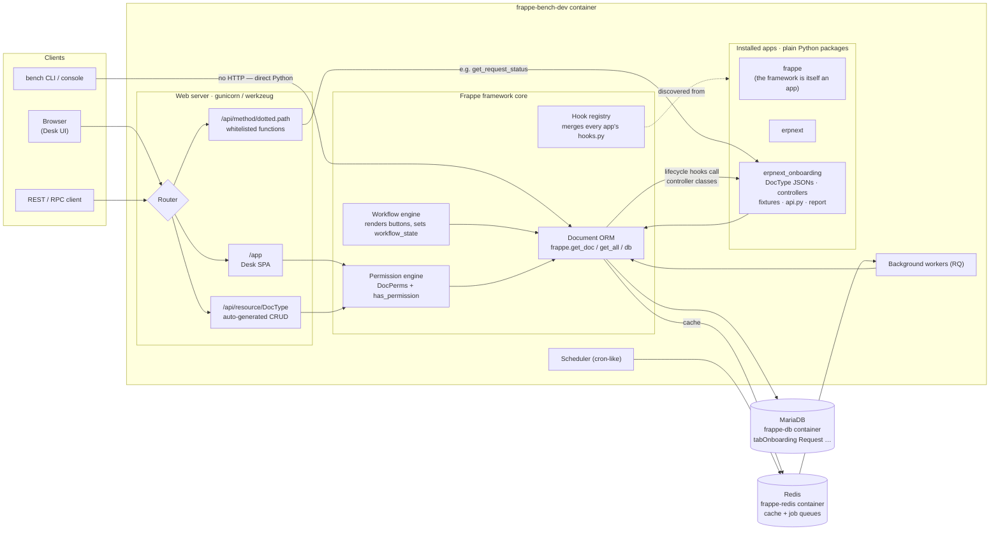
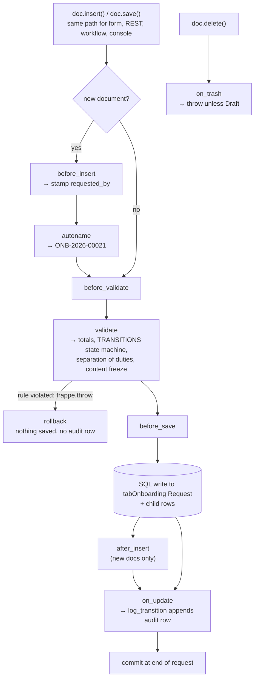

# Frappe Framework — Hello World Notes

Personal learning notes on the Frappe mental model, using this app
(`erpnext_onboarding`) as the running example. All file links are relative to this
`docs/` folder, so they are clickable in VS Code and on GitHub.

## Why Frappe feels hard — it's a different mental model

Coming from Flask/Django/Laravel-style frameworks, four things are inverted:

1. **You describe the app; the framework builds it.** A DocType is just a JSON file —
   like [onboarding_request.json](../erpnext_onboarding/erpnext_onboarding/doctype/onboarding_request/onboarding_request.json)
   — and from it Frappe auto-generates the DB table, form UI, list view, REST API, and
   permission checks. The `.py` file next to it only adds behavior (validations,
   hooks). You never write a route or a migration for it.

2. **Everything is found by naming convention, not imports.** That's why the path is
   the weird `app/app/doctype/snake_case_name/` nesting — Frappe scans it. Break the
   convention and things silently don't load.

3. **The database is hidden behind an ORM vocabulary.** `frappe.get_doc`,
   `frappe.get_all`, `frappe.db.get_value`, `doc.insert()/save()/submit()`. Tables are
   secretly named `tabOnboarding Request`. Once you learn ~6 functions, 90% of code
   becomes readable.

4. **Control flow is event-driven.** [hooks.py](../erpnext_onboarding/hooks.py)
   registers "when doc X is validated, call my function" — the framework calls *you*,
   so you can't trace code top-to-bottom like a normal web app.

The docs assume you've already internalized these four ideas, which is why tutorials
feel like they skip steps.

## Hello world, three levels

### Level 1 — prove the site is alive

```bash
docker --context default exec frappe-bench-dev bash -c \
  "cd /workspace/frappe-bench && bench --site dev.local execute frappe.ping"
# → "pong"
```

### Level 2 — talk to your data from the console

The single most useful Frappe skill: a Python REPL with a live DB connection.

```bash
docker --context default exec -it frappe-bench-dev bash -c \
  "cd /workspace/frappe-bench && bench --site dev.local console"
```

Inside it:

```python
frappe.db.count("Onboarding Request")                     # count rows
frappe.get_all("Onboarding Request",
               fields=["name", "workflow_state"])         # query like SQL SELECT

doc = frappe.get_doc("Onboarding Request", "ONB-2026-00019")
doc.as_dict()                                             # the whole ORM in two lines
```

### Level 3 — a whitelisted API endpoint

The hello-world skeleton of every Frappe endpoint (the production version of this
shape is `get_request_status` in [api.py](../erpnext_onboarding/api.py)):

```python
import frappe

@frappe.whitelist()          # ← this alone exposes it at /api/method/<dotted.path>
def hello(name: str = "world") -> dict:
    return {"message": f"hello {name}", "user": frappe.session.user}
```

Drop that in `api.py`, then call
`https://dev.local/api/method/erpnext_onboarding.api.hello?name=frappe` while logged
in — no route registration, no serializer, nothing else. The dotted Python path *is*
the URL.

## The learning loop

When any Frappe code confuses you, resolve it in this order:

1. **Is it a DocType JSON?** → structure
2. **Is it the DocType's `.py`?** → behavior
3. **Is it wired in `hooks.py`?** → when it runs
4. **Test your guess in `bench console`.**

## Architecture

### System architecture (mapped to this project's containers)



What the picture shows:

- **Every arrow into the database goes through the ORM**, and the ORM always calls
  the controller's lifecycle hooks — there is no "raw" path from the REST API to
  MariaDB. That's the architectural reason server-side rules can't be bypassed.
- **`frappe` itself is just the first app in the stack.** ERPNext and this app are
  peers of it, discovered the same way (via `hooks.py`) — "app" in Frappe-speak means
  something closer to "plugin".
- **The bench console enters below HTTP** — which is why it's a great learning tool,
  and why `ignore_permissions` exists (server code is trusted; HTTP callers are not).

### Document save lifecycle (where the controller plugs in)



The annotations after each `→` mark where this app's code from
[onboarding_request.py](../erpnext_onboarding/erpnext_onboarding/doctype/onboarding_request/onboarding_request.py)
runs. Key insight: **`validate` sits before the DB write and `on_update` after it** —
which is exactly why the audit payload is stashed in `validate` but the log row is
only written in `on_update` (a failed save must never produce an audit entry).

## Tour: this app as a Frappe tutorial

The app has one of everything. Each Frappe concept mapped to the exact file:

### 1. DocType JSON = schema, UI, and API in one file

[onboarding_request.json](../erpnext_onboarding/erpnext_onboarding/doctype/onboarding_request/onboarding_request.json)
is pure declaration; every key replaces code you'd normally write:

- `"autoname": "format:ONB-{YYYY}-{#####}"` — why records are named `ONB-2026-00019`.
- `"fieldtype": "Link", "options": "Customer"` — foreign key to ERPNext's Customer,
  plus a free typeahead widget in the form.
- `"fetch_from": "customer.customer_name"` — auto-copies the name when a customer is
  picked. One JSON key instead of a save override.
- `"read_only": 1` on `workflow_state` / `requested_by` — stops the *UI* only; the API
  could still write them, which is exactly why the controller exists.

### 2. Controller `.py` = behavior bolted onto that schema

[onboarding_request.py](../erpnext_onboarding/erpnext_onboarding/doctype/onboarding_request/onboarding_request.py)
— class `OnboardingRequest` found by naming convention, never registered. Frappe calls
its methods at fixed points in the save lifecycle:

- `before_insert` — stamps `requested_by = frappe.session.user` (provenance can't be faked).
- `validate` — runs on **every** save regardless of origin (form, REST, console).
  `TRANSITIONS` is a whitelist state machine enforcing roles, separation of duties,
  and content freeze *server-side* — the Workflow fixture only controls buttons.
- `on_update` — after a successful save; writes the audit row (so a failed save never
  leaves an orphan log entry).
- `on_trash` — blocks deleting anything past Draft.

The lifecycle `before_insert → validate → [DB write] → on_update` (+ `on_trash` on
delete) is the single most important Frappe pattern.

### 3. Child table = a DocType with `istable: 1`

[onboarding_request_item.json](../erpnext_onboarding/erpnext_onboarding/doctype/onboarding_request_item/onboarding_request_item.json)
holds line items. No independent existence — it appears because the parent JSON
declares `"fieldname": "items", "fieldtype": "Table"`. In Python the rows are just
`self.items`; `calculate_totals` recomputes amounts on every save so a client can
never send fake totals.

### 4. Second DocType, opposite personality: append-only

[onboarding_audit_log.py](../erpnext_onboarding/erpnext_onboarding/doctype/onboarding_audit_log/onboarding_audit_log.py)
— a controller can *refuse* the lifecycle: `on_update` throws unless it's the initial
insert; `on_trash` and `after_rename` always throw. Module-level `log_transition()` is
the one sanctioned insert path (scoped `ignore_permissions=True`), called from the
request's `on_update`.

### 5. hooks.py = the app's plug into the framework

[hooks.py](../erpnext_onboarding/hooks.py):

- `fixtures` — Roles, Workflow States/Actions, and the Workflow ship with the app and
  re-sync on every `bench migrate` (the "upgrade-safe" requirement in action).
- `required_apps = ["erpnext"]` — install-time dependency guard.
- The commented-out `doc_events` block is the *other* way to hook document behavior —
  for doctypes you don't own. Not needed here because the behavior lives in the owned
  controller class. Knowing both mechanisms and when each applies is a milestone.

### 6. Fixtures = clicked-together config as version-controlled JSON

[workflow.json](../erpnext_onboarding/fixtures/workflow.json),
[role.json](../erpnext_onboarding/fixtures/role.json),
[workflow_state.json](../erpnext_onboarding/fixtures/workflow_state.json),
[workflow_action_master.json](../erpnext_onboarding/fixtures/workflow_action_master.json)
are exports of records that would otherwise live only in the site DB. This is how
Frappe answers "how do I put Desk-created config in git?"

### 7. Report = three files by convention

[pending_approvals_by_age.py](../erpnext_onboarding/erpnext_onboarding/report/pending_approvals_by_age/pending_approvals_by_age.py)
— a Script Report: one `execute(filters)` returning `(columns, data, message, chart)`;
Frappe builds the whole report UI from that.
[pending_approvals_by_age.js](../erpnext_onboarding/erpnext_onboarding/report/pending_approvals_by_age/pending_approvals_by_age.js)
adds the filter controls,
[pending_approvals_by_age.json](../erpnext_onboarding/erpnext_onboarding/report/pending_approvals_by_age/pending_approvals_by_age.json)
registers it. Two deliberate decisions worth quoting: `frappe.get_list()` instead of
raw SQL so the caller's permissions apply, and the Customer column is `Data` not
`Link` to avoid coupling the report to Customer DocPerms.

### 8. API = a decorated function, nothing more

[api.py](../erpnext_onboarding/api.py) — `@frappe.whitelist()` on `get_request_status`
exposes it at `/api/method/erpnext_onboarding.api.get_request_status`. No
`allow_guest`, per-document `frappe.has_permission(..., doc=name)`, read-only.

### How it all connects: one click, end to end

An Operations Manager clicks **Approve**:

1. The **Workflow** (fixture) rendered the button; it sets
   `workflow_state = "Approved"` and saves.
2. The save triggers the **controller's** `validate`: transition looked up in
   `TRANSITIONS`, roles checked, separation of duties checked against `requested_by`,
   content freeze verified, `approved_by`/`decided_on` stamped server-side, audit
   payload stashed in `self.flags`.
3. The row hits the **table** the DocType JSON generated, child rows included.
4. `on_update` calls `log_transition` — one append-only audit row.
5. The **report** shows one fewer pending request; the **API** returns the new state
   plus full history.

A script trying the same via REST with a Sales Officer session — skipping the UI —
throws `PermissionError` at step 2. That's the assessment's thesis ("rules in Python,
not just Workflow") traced through six files.

## Where does business logic go? (there is no service layer)

Frappe follows the **Active Record** school (Rails, Django fat-models), not the
layered/service school (Spring, NestJS, Laravel-with-services). The document
controller **is** the service layer — and Frappe gives a guarantee that makes this
safer than it sounds.

### Why Frappe can get away with no service layer

In a layered app the service layer exists because the ORM is promiscuous: any code can
`repository.save(entity)` and skip the rules, so team discipline says "always go
through `OnboardingService.approve()`". The service layer is a *convention* protecting
an unguarded write path.

In Frappe, the write path itself is guarded. Whether a write comes from the Desk form,
`/api/resource`, a workflow button, or `frappe.get_doc(...).save()` in someone else's
code — it **always** executes the controller's `validate`/`on_update`. There is no
path to `tabOnboarding Request` that skips
[onboarding_request.py](../erpnext_onboarding/erpnext_onboarding/doctype/onboarding_request/onboarding_request.py).
The thing a service layer exists to guarantee — "no write without the rules" — the
framework enforces structurally.

### Rough translation table

| Layered framework | Frappe equivalent |
| --- | --- |
| Entity / model | DocType JSON |
| Repository / DAO | `frappe.get_doc`, `frappe.get_all`, `frappe.db` |
| Service layer (invariants) | Document controller hooks (`validate`, `on_update`…) |
| Service layer (use-case orchestration) | Plain module-level functions in the app |
| Controller / routes | Auto-generated REST + `@frappe.whitelist()` functions |
| DTO / serializer | `doc.as_dict()` — mostly unnecessary |
| Event listeners | `doc_events` in hooks.py |
| Async jobs | `frappe.enqueue` + RQ workers |

### Where each kind of logic goes — this app does all three

1. **Single-document invariants** ("a rejection needs a reason", "content is frozen
   after submit") → the **controller**. The `TRANSITIONS` state machine is exactly this.

2. **Cross-document orchestration** — the classic "service method" — → **plain
   module-level functions**, usually next to the doctype they serve. `log_transition()`
   in [onboarding_audit_log.py](../erpnext_onboarding/erpnext_onboarding/doctype/onboarding_audit_log/onboarding_audit_log.py)
   *is* a service function: it lives outside the class, takes a document, coordinates a
   write to another doctype. ERPNext works this way everywhere — `make_sales_invoice()`,
   `get_item_details()` are module functions beside their doctypes, not `*Service`
   classes. A growing app can add `services/whatever.py` with plain functions — only
   doctype folders are magic; other modules are ordinary Python.

3. **Reacting to doctypes you don't own** ("when a Customer is renamed…") →
   `doc_events` in [hooks.py](../erpnext_onboarding/hooks.py). This replaces the
   event-listener/subscriber pattern.

The thin layers stay thin: [api.py](../erpnext_onboarding/api.py) is a classic thin
application-layer endpoint (auth, permission check, shape the response — no business
rules), and the Workflow fixture is pure UI orchestration with zero authority.

### The one real trade-off: the fat controller

Because Frappe guarantees `validate` always runs, the lazy path is to dump *every*
rule into it, inline. A year later it's 1500 lines of nested ifs mixing state checks,
money math, and logging — it still works, it's just unreadable. Nothing in the
framework stops this; discipline has to.

The fix has three parts, all visible in
[onboarding_request.py](../erpnext_onboarding/erpnext_onboarding/doctype/onboarding_request/onboarding_request.py):

**1. Make the hook a table of contents, not the book.**

```python
def validate(self):
    self.validate_line_values()    # are qty/rate/discount sane?
    self.calculate_totals()        # recompute money
    self.enforce_state_machine()   # is this state change legal?
```

Logic lives in named methods; the hook only dispatches. When a rule breaks, its name
tells you which method to open.

**2. Write rules as data, not if-chains.** Instead of eight `elif old == X and
new == Y` branches each repeating the same role/items/reason checks, the `TRANSITIONS`
dict describes every legal transition once:

```python
TRANSITIONS = {
    ("Pending Approval", "Approved"): dict(roles={"Operations Manager"},
                                           separation_of_duties=True, ...),
    ("Pending Approval", "Rejected"): dict(roles={"Operations Manager"},
                                           separation_of_duties=True,
                                           require_reason=True, ...),
}
```

The dict is a rulebook you read; `validate_transition` is the one referee that reads
it. A new transition = one new dict entry; each check is implemented exactly once.

**3. When a rule outgrows the class, promote it to a module function.** Say a future
rule spans doctypes: "block approval if the Customer has overdue invoices". Put the
logic in a plain function and call it *from* the hook:

```python
# services/credit.py — plain Python, testable alone, reusable anywhere
def assert_customer_in_good_standing(customer: str):
    overdue = frappe.db.count("Sales Invoice",
        {"customer": customer, "status": "Overdue"})
    if overdue:
        frappe.throw(f"{customer} has {overdue} overdue invoices")

# onboarding_request.py
def validate(self):
    ...
    assert_customer_in_good_standing(self.customer)
```

The hook stays the **guaranteed entry point** (Frappe promises it runs on every save,
so the rule can't be skipped); the function holds the **logic** (easy to unit-test and
reuse). `log_transition()` in the audit log module is this exact pattern, live.

**One-line summary:** hooks decide *when* rules run (guaranteed); named methods and
module functions decide *what* the rules are (readable). Never let the *what* pile up
inside the *when*.

### This is data-driven programming — and so is all of Frappe

`TRANSITIONS` is textbook **data-driven (table-driven) programming**: behavior lives
in a data structure (a *transition table*, in state-machine terms), and a small
generic engine interprets it. Frappe calls itself a "metadata-driven framework" —
the same pattern at every scale:

| Data (the rulebook) | Engine (the referee) |
| --- | --- |
| `TRANSITIONS` dict | `validate_transition()` |
| DocType JSON | form renderer, table generator, REST API |
| Workflow fixture | workflow engine rendering buttons |
| DocPerms rows | permission engine |
| `fixtures` list in hooks.py | `bench migrate` sync |
| Report `.json` + columns list | report view |

This is why Frappe feels alien at first: the instinct from other frameworks is to
look for *code that does things*, but in a metadata-driven system most of the program
is *data that describes things*, interpreted by generic framework code.

Trade-off: data-driven shines while rules are **uniform** — every transition answers
the same questions (who? items required? reason required?), so each rule is one dict
entry. When a rule stops fitting the schema, don't contort the table with one-off
flags — drop back to plain code (the module-function escape hatch above). Knowing
when to stop adding flags to the table is the skill.

**The mental shift:** stop asking "which layer does this belong to" and ask "which
document's save does this rule guard." Guards a save → controller hook. Coordinates
several documents → module function called from a hook or whitelisted endpoint.
Reacts to someone else's document → `doc_events`.

## Multi-DocType interactions in one method

Two layers: a **transaction guarantee** that makes it safe, and **orchestration
patterns** for structuring it.

### The foundation: one request = one database transaction

Frappe wraps every HTTP request (and whitelisted method call) in a single MariaDB
transaction. Commit happens automatically at the end of a successful request; any
uncaught exception rolls back **everything**:

```python
def on_submit(self):
    frappe.get_doc("Stock Entry", {...}).insert()
    frappe.get_doc("GL Entry", {...}).insert()
    other = frappe.get_doc("Timesheet", row.time_sheet)
    other.status = "Billed"
    other.save()
    frappe.throw("something wrong")   # ← ALL of the above roll back
```

No unit-of-work object, no `@Transactional` — the request *is* the transaction.
This app relies on it silently: an approval's state change and its audit row from
`log_transition()` are one atomic unit — "no state change without an audit row, no
audit row without a state change" comes for free.

### Pattern 1: the driving document orchestrates (most common)

One DocType is the "verb" of the business event; its lifecycle hook creates/updates
the others. ERPNext's Sales Invoice `on_submit` validates against Authorization
Control, creates Stock Ledger Entries and GL Entries, and updates linked Timesheets —
four other DocTypes from one hook, one transaction. This app's
`on_update → log_transition()` is the same pattern in miniature. Put orchestration in
the hook of the document that *represents the event*; keep writing logic in named
functions.

### Pattern 2: mapped documents — "make X from Y"

For "create a Sales Order from this Quotation" flows:
`frappe.model.mapper.get_mapped_doc` — declare a field mapping (data-driven again),
expose it as a whitelisted function; the UI's "Create ▸" buttons call these. A future
"Create Storage Agreement from Onboarding Request" step would use this.

### Pattern 3: `doc_events` — react to documents you don't own

"When *their* DocType changes, update *mine*" — you can't edit ERPNext's controller,
so register in hooks.py:

```python
doc_events = {
    "Customer": {"on_trash": "erpnext_onboarding.overrides.customer.block_if_open_requests"}
}
```

Frappe merges every app's registrations; the function runs inside Customer's
lifecycle, same transaction, no ERPNext code touched.

### Pattern 4: a whitelisted service function coordinates peers

When no single document is naturally in charge, write a module-level function (the
service-layer stand-in) and expose it with `@frappe.whitelist()`. Still one
transaction — it's still one request.

### Three gotchas

1. **`frappe.db.commit()` mid-method breaks atomicity.** Commit early and a later
   exception can't roll back what you committed — the business event becomes two
   half-transactions. Old tutorials sprinkle it everywhere; don't.
2. **`frappe.enqueue()` escapes the transaction.** Background jobs run later, in
   their own transaction. Fine for laggy side-effects (email, sync); never for writes
   that must succeed *with* the triggering save.
3. **Cross-DocType writes run as the session user.** Inside `on_update`, saving
   another DocType still checks *that* DocType's permissions against the current
   user — precisely why `log_transition` needs its scoped `ignore_permissions=True`
   (a Sales Officer has no write permission on the audit log, yet their submit must
   produce a row).

## Gotcha discovered along the way (2026-07-11)

`bench` commands failed with `Access denied for user '<db_user>'@'172.19.0.3'`.
Cause: at site creation, Frappe grants MariaDB access to the bench container's *exact
IP*. After a container restart the bench container got a new IP and the grant no
longer matched. Fix (made permanent by using a wildcard host):

```bash
docker --context default exec frappe-db bash -c \
  "mysql -uroot -p<root password from docker-compose.yml> -e \
   \"CREATE USER IF NOT EXISTS '<db_user>'@'%' IDENTIFIED BY '<db_password>'; \
   GRANT ALL PRIVILEGES ON \\\`<db_user>\\\`.* TO '<db_user>'@'%'; FLUSH PRIVILEGES;\""
```

The site's DB name/password live in `frappe-bench/sites/dev.local/site_config.json`
(not version controlled).
